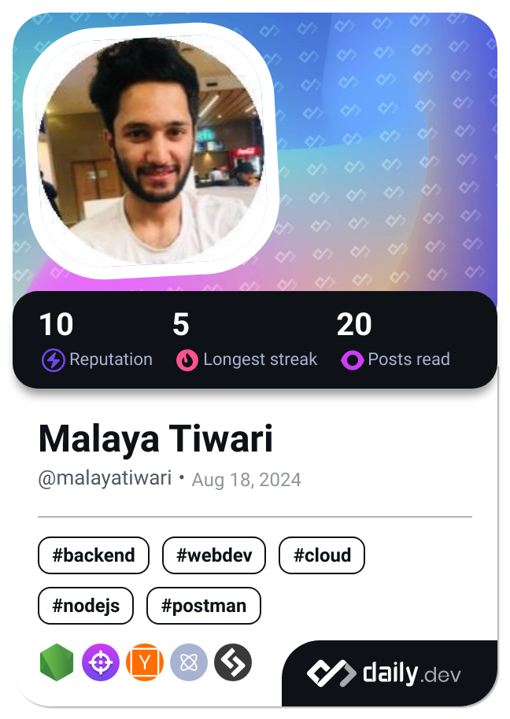

 <h1 align="center">👋 Hi there, I'm Malaya Tiwari</h1>
 
I'm a Full Stack Developer with 1 year of hands-on experience building web applications using the MERN stack (MongoDB, Express, React, Node.js). I enjoy creating clean, responsive UIs and writing scalable backend APIs. I’m passionate about problem-solving and building products that solve real-world challenges.

 <h2>Currently: Working on Social media Application Echo</h2>
 
 🛠️ Tech Stack
 
Frontend: React, Redux, HTML5, CSS3, JavaScript (ES6+), Tailwind CSS, Bootstrap

Backend: Node.js, Express.js, MongoDB, REST APIs, Socket.io

Tools: Git & GitHub, Postman, VS Code, Vercel, Netlify

Others: JWT Auth, MVC Architecture, WebSockets, Mongo Atlas, Axios

 <h2>Projects</h2>
  <h4>Portfolio - https://malaya-tiwari.netlify.app/</h4>
  <h4>QuantumQuik Shop - https://quantum-quik-shop.vercel.app/</h4>
  <h4>Echo: where developers meet - https://echo-xi-dusky.vercel.app</h4>
 <h4>Quantum Verse - https://quantum-verse-frontend.vercel.app/login</h4>
 <h4>Event Management - https://event-management-frontend-beryl.vercel.app/</h4>
  
### Languages and Tools:

<!--  <!-->

